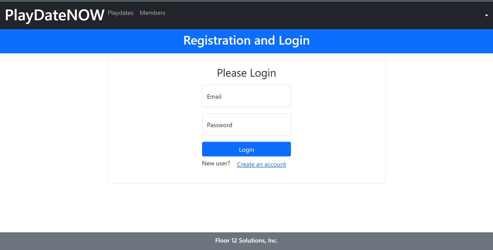

# Project: playdatenow

 

<h2>What Is A Playdate?</h2>

A playdate is a designated time for two children to visit and play together. Parents set the time, date, and location for a playdate ahead of time. Playdates typically last for a few hours before the parent who isn’t hosting the playdate picks up their child.

 <h3>Playdate Place And Location Ideas</h3>

- One Parent’s House
- Local Park
- Museum
- Water Park
- Local Gardens
- Bounce House Centers
- Zoo
- Aquarium
- Bowling Alley
- Roller Rink
- Mini Golf Course

This is an DevOps Bootcamp capstone project (Saudi Digital Academy and CodingDojo)

